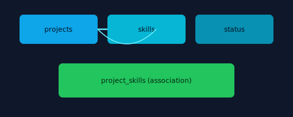
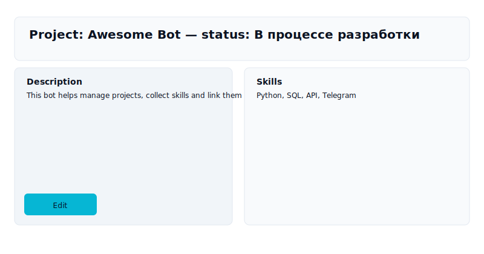

# M3L2 — Управление проектами (Project Manager)

Добро пожаловать в небольшой, но бодрый проект на Python для хранения и управления информацией о проектах, навыках и статусах с помощью SQLite. Я немного приукрасил README: добавил заголовок, дружелюбное описание и пару иллюстраций, чтобы документация выглядела живее.

## О чем этот репозиторий

Проект хранит данные о проектах (название, описание, ссылка, дедлайн, статус), списке возможных навыков и связях между проектами и навыками. Всё реализовано на чистом Python с использованием встроенной SQLite — ничего лишнего.

Ключевой модуль: `logic.py` — класс `DB_Manager` предоставляет CRUD-операции для таблиц `projects`, `skills`, `project_skills` и `status`.

## Структура проекта (содержание)

- `logic.py` — реализация менеджера БД (`DB_Manager`).
- `config.py` — настройки (токен для бота, имя файла БД).
- `assets/` — вспомогательные картинки и схемы (добавлены SVG для README).
- `database.db` — файл SQLite (создаётся при первом запуске).

## Возможности (быстро)

- Создание таблиц и начальная загрузка данных.
- Добавление/обновление/удаление проектов и навыков.
- Связывание проектов с навыками (many-to-many через `project_skills`).
- Получение агрегированной информации по проектам (статусы, навыки).

## Скриншоты и схема

Ниже — простые иллюстрации: схема данных и пример «скриншота» интерфейса (SVG, в папке `assets`).





## Быстрый старт — как запустить

1. Убедитесь, что у вас установлен Python 3.11+.
2. В корне проекта запустите:

```powershell
python logic.py
```

Это создаст файл `database.db` и заполнит таблицы начальными значениями (навыки и статусы).

## Пример использования из кода

```python
from logic import DB_Manager
from config import database

manager = DB_Manager(database)
manager.create_tables()
manager.default_insert()

# Добавить проект (пример):
manager.insert_project([(1, 'Awesome Bot', 'Бот для управления проектами', 'https://example.com', 2)])
```

## Немного самовыражения

Я добавил простые SVG, чтобы README выглядел дружелюбнее. Если хочешь — могу сгенерировать более стильные PNG/PNG-скриншоты, или добавить GIF с демонстрацией добавления проекта.

---

Если нужно, обновлю документацию дальше: примеры CLI, тесты или миграции БД — что предпочитаешь?
